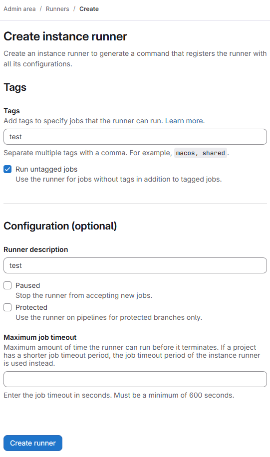
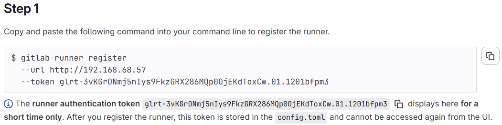
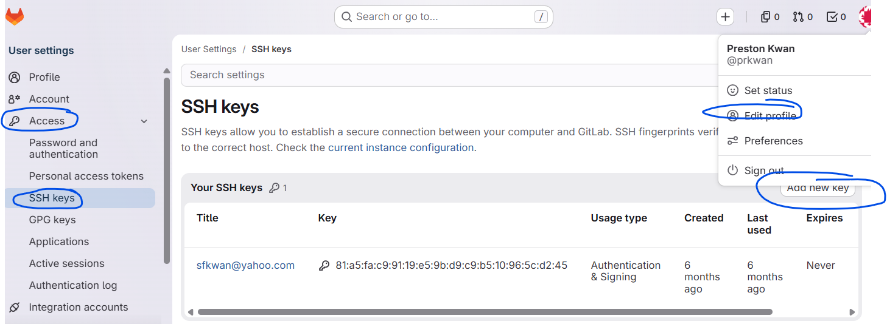
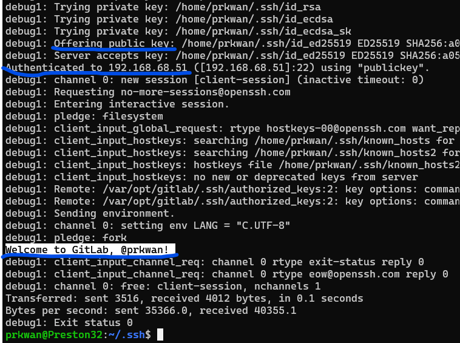

# docker-compose

Madatory to set up external_url for GitLab runner to register and git clone using ssh

    environment:
      GITLAB_OMNIBUS_CONFIG: |
        external_url 'http://192.168.68.57:8080'

---

# GitLab runner config (config.toml)

http://192.168.68.57:8080/admin/runners





## Configuration (config.toml)

```
concurrent = 5
[[runners]]
  request_concurrency = 4
  [runners.docker]
    <!-- Need to mount to host socket to use the docker engine  -->
    volumes = ["/cache", "/var/run/docker.sock:/var/run/docker.sock"]
    <!-- Avoid pull image everytime -->
    pull_policy = "if-not-present"
```

# Add SSH Keys

https://docs.gitlab.com/user/ssh/

## Create SSH key

```shell
ssh-keygen -t ed25519 -C "[email]"
```

## Add SSH key

In the upper-right corner, select your avatar.  
Select Edit profile.  
On the left sidebar, select SSH Keys.  
Select Add new key.



## Verify SSH connection

```shell
ssh -Tv git@192.168.68.57
```


